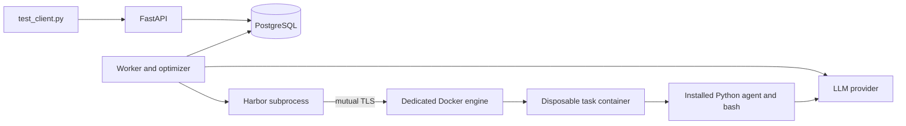

# Agent Optimization Service

A FastAPI service that queues TerminalBench runs, executes a terminal agent inside
Docker task containers, proposes prompt improvements using an LLM, and persists
every iteration in PostgreSQL. Organization administrators manage members and see
all organization jobs; members submit and view their own jobs.

The original harness is preserved. Its documentation is in
[docs/UPSTREAM_README.md](docs/UPSTREAM_README.md). The service is separate from
the original `prepare.py` / `gating.py` command-line workflow.

## Setup and run

Requirements: Docker Desktop in Linux-container mode with Compose, Python 3.12+
for the client, internet access for images/tasks, and an OpenAI API key (or an
OpenAI-compatible endpoint supporting chat tool calls and JSON mode). Python
dependencies run in containers. Allow at least 6 GB of Docker memory and several
GB of disk for task images.

```sh
python -m service.init_env
```

Edit the generated, gitignored `.env`:

```dotenv
OPENAI_API_KEY=your-key
AGENT_MODEL=gpt-4.1-mini
OPTIMIZER_MODEL=gpt-4.1-mini
# BOOTSTRAP_TOKEN is generated by init_env; keep its random value.
```

`OPENAI_BASE_URL` defaults to `https://api.openai.com/v1`. Model access and credit
availability depend on your provider account. An E2B key is a sandbox credential,
not an LLM key. The service supports Docker; E2B is not required or currently enabled.

```sh
docker compose -f compose.service.yaml up --build -d
docker compose -f compose.service.yaml logs -f worker
```

API: **http://localhost:8080**. Interactive docs: **http://localhost:8080/docs**.
Database readiness: `/health`. Migrations run automatically before API and worker
startup. PostgreSQL and the sandbox engine have no published host ports. The
separate Compose project leaves the original `docker-compose.yml` and unrelated
containers untouched.

Start with one real task and no optimizer call:

```sh
python test_client.py --task-ids fix-git --max-iterations 0
```

Then run all 10 selected tasks and up to two proposed improvements:

```sh
python test_client.py
```

The client creates a demo organization using `BOOTSTRAP_TOKEN`, submits a job,
polls, and prints JSON containing the job and **complete iteration history**:
runnable agent source, proposals, scores, task outcomes and bounded traces.
Progress goes to stderr. Exit 0 means the job completed, including a plateau;
exit 1 means failure, cancellation or client timeout. A completed job does not
imply every task passed.

Client-created credentials are saved in ignored `workspace/client-<org-id>.json`,
never printed in the summary. Reuse an identity with `--org-id` and `--token` (or
`ORG_ID` and `API_TOKEN`). Resume polling with `--job-id`. A client timeout does
not cancel its server job; use the cancellation endpoint when desired.

After changing `.env`, recreate services with `docker compose -f
compose.service.yaml up -d`; a plain restart does not reload environment variables.
If changing models, submit a new job: existing jobs retain their execution settings.
Stop with `docker compose -f compose.service.yaml down`; named volumes preserve
database state, artifacts and image caches.

## API and roles

All routes below except organization creation require
`Authorization: Bearer <api_token>`. Tokens contain 256 bits of randomness and only
SHA-256 hashes are stored in PostgreSQL. Provisioning returns a token once.
`/health` is public; `/tasks` requires authentication.

| Route | Behavior / required role |
|---|---|
| `POST /organizations` | `X-Bootstrap-Token`; creates organization and administrator |
| `GET /organizations` | Lists caller's memberships |
| `GET /tasks` | Fixed dataset and supported task IDs |
| `GET /organizations/{org}/members` | Administrator lists members |
| `POST /organizations/{org}/members` | Administrator provisions member and token; accepts `name`, `role` |
| `PUT /organizations/{org}/members/{user}` | Administrator adds existing user or changes role |
| `DELETE /organizations/{org}/members/{user}` | Administrator revokes membership; last admin is protected |
| `POST /organizations/{org}/jobs` | Member/admin; returns **202** with queued job |
| `GET /organizations/{org}/jobs` | Admin sees all; member sees own; bounded `limit` / `offset` |
| `GET /organizations/{org}/jobs/{job}` | Status, best score/version and stop reason |
| `GET /organizations/{org}/jobs/{job}/iterations` | Full ordered history including rejected/interrupted attempts |
| `POST /organizations/{org}/jobs/{job}/cancel` | Owner or admin; idempotent cancellation |

Example submission:

```json
{"task_ids": ["fix-git", "regex-log"], "max_iterations": 2}
```

Omitting tasks selects all 10. `max_iterations` counts proposals **after baseline**,
ranges from 0 to 5, and defaults to 2. The server fixes models, dataset, budgets
and provider. Requests cannot supply code, paths or arbitrary datasets. Invalid
fields, duplicate/unknown IDs and invalid bounds return 422. `/openapi.json`
describes request and response schemas.

`Idempotency-Key` makes concurrent retries return the same job for the same user
and organization; reuse with a changed body returns 409. Each organization may
have at most 10 queued/running jobs (429 thereafter). Missing/invalid tokens return
401, unauthorized admin operations return 403, and inaccessible jobs/organizations
return 404 to avoid leaking their existence.

## Selected TerminalBench tasks

Dataset: **TerminalBench 2.0**, pinned through Harbor's `terminal-bench@2.0`
registry entry. Exact IDs and metadata were verified against the downloaded dataset.
Selection used public metadata, not oracle solutions.

| Task | Difficulty | Why selected |
|---|---|---|
| `fix-git` | Easy | Small Git recovery task; first integration smoke test |
| `git-leak-recovery` | Medium | Git history and sensitive-file cleanup |
| `regex-log` | Medium | Precise text parsing and output requirements |
| `log-summary-date-ranges` | Medium | Date boundaries, aggregation and reporting |
| `build-cython-ext` | Medium | Python/native build and dependency debugging |
| `configure-git-webserver` | Hard | Service setup and Git configuration |
| `fix-code-vulnerability` | Hard | Security-oriented source repair |
| `extract-elf` | Medium | Binary inspection and file extraction |
| `nginx-request-logging` | Medium | Web server configuration and validation |
| `sqlite-db-truncate` | Medium | Database-file recovery and troubleshooting |

This CPU-only mix spans six categories and avoids GPU training, large model downloads
and long scientific builds. Runs use two concurrent tasks, 1 CPU and 2 GB RAM per
task, 80 agent steps, 120 seconds per bash command and a **300-second agent budget**.
An iteration has a one-hour outer deadline including downloads/setup/verification.
Ten tasks have about 25 minutes of maximum agent execution at concurrency two,
plus overhead: this is a budget estimate, **not measured full-subset runtime**.

The original task budgets are 900 seconds. Shorter service budgets and resource
overrides make this a local optimization experiment, not a leaderboard submission.
Every version in a job receives identical budgets and the same subset.

## Design decisions



**Queue and recovery.** PostgreSQL is queue and source of truth, avoiding a second
broker and database/broker dual writes. Workers claim with `FOR UPDATE SKIP LOCKED`,
renew a 90-second lease every 10 seconds, and fence writes with a unique claim token.
No transaction remains open during inference or benchmarking. Crashes permit reclaim
after lease expiry, up to three worker attempts, then fail explicitly. Concurrent
claims and restart recovery are tested against PostgreSQL.

**State.** Before execution, an iteration persists its prompt, full runnable source,
SHA-256 and proposal. Results and the job's best-version pointer commit atomically.
A reclaimed job retains completed iterations and retries its interrupted candidate
with the same source/proposal in a fresh sandbox; the old attempt stays visible.
This is at-least-once execution with fenced commits, not exactly-once external API
calls: crashes may repeat work and cost. Cancellation fences writes immediately;
the worker observes it at its next heartbeat and stops Harbor/remaining containers.

**Agent isolation.** The original template uses a Harbor external agent.
`service/harbor_agent.py` instead installs a standalone adaptation inside each task
environment. It preserves the baseline prompt, bash interface, step loop and output
truncation. The worker never executes agent reasoning or LLM-proposed source. Only
the system prompt changes, inserted as a Python string literal into a fixed runtime.
The optimizer cannot edit tools, budgets, task fixtures or verifiers.

The API has no Docker access or inference key. The worker controls a dedicated
Docker-in-Docker engine using mutual TLS. Task containers receive only inference
credentials, model and endpoint; no database/bootstrap/E2B credentials, Docker
socket, client certificates or shared job workspace. Each receives only its own
Harbor log/artifact mounts. Harbor runs the verifier after the agent and removes
environments on completion; cancellation/stale-worker cleanup targets containers
identified by their own run mounts.

The dedicated engine is a privileged infrastructure container. This is a local
development boundary with a shared kernel. A hostile public deployment should
use dedicated VMs/microVMs and enforce egress/disk quotas. The inference key is
accessible to its agent; scoped keys or an inference proxy would improve this.

**Optimization.** The LLM receives the best prompt, bounded failure traces,
verifier summaries and previous proposal/score history. Pydantic validates its JSON
response. Acceptance requires strictly higher mean reward with no regression on
previously passing tasks. A tie/regression stops with `no_improvement`; all-pass
or the iteration cap also stops. Rejected versions stay inspectable and the best
version is retained. Infrastructure errors fail with evidence rather than becoming
false learning signals. Missing results never disappear from the denominator.

The same subset guides and evaluates changes, so improvement may overfit. These
are development scores, not evidence of generalization. Model sampling noise also
affects one-run comparisons; held-out evaluation and repeated trials are next steps.

**Persistence.** Versioned SQL migrations, users, memberships, jobs, sources and
bounded result/trace excerpts live in PostgreSQL. Full raw Harbor artifacts remain
in a private volume. Excerpts are marked when truncated and known service credential
values are redacted before persistence. Raw artifacts currently require operator
retention management. Service and Harbor dependencies are locked separately so
Harbor upgrades cannot silently change the API environment.

## Tests and observed validation

Create a separate test database once; the suite refuses names not ending `_test`:

```sh
docker compose -f compose.service.yaml exec db createdb -U harness harness_test
docker compose -f compose.service.yaml run --rm --no-deps -e DATABASE_URL=postgresql://harness:local-development-only@db:5432/harness_test api python -m pytest -q
```

If you changed `POSTGRES_PASSWORD`, use that password in the test URL. Tests truncate
only this database. They cover tenant/owner isolation, roles, idempotency, concurrent
claims, fencing, recovery, cancellation, history/plateau behavior, regressions,
malformed results, optimizer validation, and the actual client over live HTTP.

Real container integration smoke test without an LLM key:

```sh
docker compose -f compose.service.yaml run --rm --no-deps worker python -m tests.sandbox_smoke
```

This launches the real `fix-git` task, installed runtime and Harbor verifier. A local
HTTP fixture supplies a harmless bash command that checks isolation and prints a
marker. The verifier rejects the deliberately unsolved task. It verifies integration,
**not LLM performance**. No fixture mode is exposed in the production API/worker.
See [docs/VALIDATION.md](docs/VALIDATION.md) for observed results and remaining checks.

## Scope, omissions and more time

All five milestones have implementation paths and automated coverage. The service
optimizes prompts rather than unrestricted agent code, supports one sandbox backend
and one OpenAI-compatible inference interface, and uses operator token provisioning
rather than SSO. Full live LLM validation depends on provider credentials; see the
validation record. E2B is a natural future backend, but is not claimed as tested.

With more time: held-out/repeated evaluations, measured subset runtime, spend
accounting/budgets, fair organization scheduling, per-task checkpoints, transient
provider retry policy, artifact retention/object storage, connection pooling,
token rotation/expiry and audit events, egress controls and VM-backed sandboxes.

References: [TerminalBench 2.0 source](https://github.com/harbor-framework/terminal-bench-2),
[Harbor agents](https://www.harborframework.com/docs/agents),
[OpenAI chat completions](https://developers.openai.com/api/reference/python/resources/chat/subresources/completions/methods/create).
