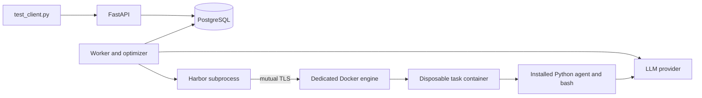

# Agent Optimization Service

A FastAPI service that runs and optimizes terminal agents in Docker sandboxes.
PostgreSQL stores jobs, immutable multi-file harness packages, skills, proposals,
experiment plans and every task attempt. The search space includes tool schemas
and dispatch, context management, skills and agent control flow. Organization
administrators manage members and see organization activity; members see their own.

The original harness is preserved. Its documentation is in
[docs/UPSTREAM_README.md](docs/UPSTREAM_README.md). The service is separate from
the original `prepare.py` / `gating.py` command-line workflow.

## Setup and run

Requirements: Docker Desktop in Linux-container mode with Compose, Python 3.12+
for the client, internet access for images/tasks, and an OpenAI API key (or an
OpenAI-compatible endpoint supporting chat tool calls and JSON mode). Python
dependencies run in containers. Allow at least 6 GB of Docker memory and several
GB of disk for task images.

```sh
python -m service.init_env
```

Edit the generated, gitignored `.env`:

```dotenv
OPENAI_API_KEY=your-key
AGENT_MODEL=gpt-4.1-mini
OPTIMIZER_MODEL=gpt-4.1-mini
# Optional for reasoning-capable optimizers: OPTIMIZER_REASONING_EFFORT=medium
# BOOTSTRAP_TOKEN is generated by init_env; keep its random value.
```

For the flagship baseline experiment, use these agent settings instead:

```dotenv
AGENT_MODEL=gpt-6-astra
AGENT_API=responses
AGENT_REASONING_EFFORT=xhigh
AGENT_MAX_OUTPUT_TOKENS=32768
```

The agent retains its original policy and bash tool. Responses preserves native
reasoning items and assistant phases between tool calls; incomplete model output
is recorded as an error. These settings are captured in each job. Astra requires
Responses for tool calling; the larger output allowance includes reasoning tokens.
See [OpenAI's model guidance](https://developers.openai.com/api/docs/guides/latest-model).
Use `python test_client.py --max-iterations 0` to evaluate the baseline alone.
The optimizer has its own model setting and continues to use Chat Completions.

`OPENAI_BASE_URL` defaults to `https://api.openai.com/v1`. Model access and credit
availability depend on your provider account. An E2B key is a sandbox credential,
not an LLM key. The service supports Docker; E2B is not required or currently enabled.

```sh
docker compose -f compose.service.yaml up --build -d
docker compose -f compose.service.yaml logs -f worker
```

API: **http://localhost:8080**. Interactive docs: **http://localhost:8080/docs**.
Database readiness: `/health`. Migrations run automatically before API and worker
startup. PostgreSQL and the sandbox engine have no published host ports. The
separate Compose project leaves the original `docker-compose.yml` and unrelated
containers untouched.

Start with one real task and no optimizer call:

```sh
python test_client.py --task-ids fix-git --max-iterations 0
```

Then run all 10 selected tasks and up to two proposed improvements:

```sh
python test_client.py
```

The client creates a demo organization using `BOOTSTRAP_TOKEN`, submits a job,
polls, and prints JSON containing the job and **complete iteration history**:
runnable agent source, proposals, scores, task outcomes and bounded traces.
Progress goes to stderr. Exit 0 means the job completed, including a plateau;
exit 1 means failure, cancellation or client timeout. A completed job does not
imply every task passed.

Client-created credentials are saved in ignored `workspace/client-<org-id>.json`,
never printed in the summary. Reuse an identity with `--org-id` and `--token` (or
`ORG_ID` and `API_TOKEN`). Resume polling with `--job-id`. A client timeout does
not cancel its server job; use the cancellation endpoint when desired.

After changing `.env`, recreate services with `docker compose -f
compose.service.yaml up -d`; a plain restart does not reload environment variables.
If changing models, submit a new job: existing jobs retain their execution settings.
Stop with `docker compose -f compose.service.yaml down`; named volumes preserve
database state, artifacts and image caches.

## Compare tools, context and skills

```sh
docker compose -f compose.service.yaml up -d --scale worker=2
python test_client.py --experiment --task-ids fix-git log-summary-date-ranges nginx-request-logging --repetitions 2
```

This queues three independent LLM proposals, validates their complete packages in
offline sandboxes, and compares them with a frozen baseline: 24 development task
executions in this example. Omitting `--task-ids` uses the full ten-task subset.
The model and budgets stay fixed across versions. A failed/worse candidate does
not erase other results or stop an already submitted experiment. Complete source,
file hashes/diffs, proposals, per-task outcomes and iteration history are saved by
the client. No experimental candidate is automatically promoted.

The client resumes from its saved `--state` file; completed task trials are not
rerun. `--prepare-only` generates proposals without benchmark execution. Optional
held-out tasks run after development trials and cannot be supplied as proposal
evidence through the API. See [the package and experiment API](docs/EXPERIMENT_PLATFORM.md)
for commands, schema, profiles and limitations, and [the failure drill](docs/OPERATIONS.md)
for measured worker recovery and capacity behavior.

## API and roles

All routes below except organization creation require
`Authorization: Bearer <api_token>`. Tokens contain 256 bits of randomness and only
SHA-256 hashes are stored in PostgreSQL. Provisioning returns a token once.
`/health` is public; `/tasks` requires authentication.

| Route | Behavior / required role |
|---|---|
| `POST /organizations` | `X-Bootstrap-Token`; creates organization and administrator |
| `GET /organizations` | Lists caller's memberships |
| `GET /tasks` | Fixed dataset and supported task IDs |
| `GET /organizations/{org}/members` | Administrator lists members |
| `POST /organizations/{org}/members` | Administrator provisions member and token; accepts `name`, `role` |
| `PUT /organizations/{org}/members/{user}` | Administrator adds existing user or changes role |
| `DELETE /organizations/{org}/members/{user}` | Administrator revokes membership; last admin is protected |
| `POST /organizations/{org}/jobs` | Member/admin; returns **202** with queued job |
| `GET /organizations/{org}/jobs` | Admin sees all; member sees own; bounded `limit` / `offset` |
| `GET /organizations/{org}/jobs/{job}` | Status, best score/version and stop reason |
| `GET /organizations/{org}/jobs/{job}/iterations` | Full ordered history including rejected/interrupted attempts |
| `POST /organizations/{org}/jobs/{job}/cancel` | Owner or admin; idempotent cancellation |

Example submission:

```json
{"task_ids": ["fix-git", "regex-log"], "max_iterations": 2}
```

Omitting tasks selects all 10. `max_iterations` counts proposals **after baseline**,
ranges from 0 to 5, and defaults to 2. This original optimization endpoint uses
server-configured models and budgets. The separate harness-version endpoint accepts
validated package contents, and experiments accept bounded model profiles. All
benchmark task IDs remain allowlisted. Invalid
fields, duplicate/unknown IDs and invalid bounds return 422. `/openapi.json`
describes request and response schemas.

`Idempotency-Key` makes concurrent retries return the same job for the same user
and organization; reuse with a changed body returns 409. Each organization may
have at most 10 queued/running non-trial jobs and three active experiments (429
thereafter). Trial admission uses a shared sandbox capacity pool. Missing/invalid tokens return
401, unauthorized admin operations return 403, and inaccessible jobs/organizations
return 404 to avoid leaking their existence.

## Selected TerminalBench tasks

Dataset: **TerminalBench 2.0**, pinned through Harbor's `terminal-bench@2.0`
registry entry. Exact IDs and metadata were verified against the downloaded dataset.
Selection used public metadata, not oracle solutions.

| Task | Difficulty | Why selected |
|---|---|---|
| `fix-git` | Easy | Small Git recovery task; first integration smoke test |
| `git-leak-recovery` | Medium | Git history and sensitive-file cleanup |
| `regex-log` | Medium | Precise text parsing and output requirements |
| `log-summary-date-ranges` | Medium | Date boundaries, aggregation and reporting |
| `build-cython-ext` | Medium | Python/native build and dependency debugging |
| `configure-git-webserver` | Hard | Service setup and Git configuration |
| `fix-code-vulnerability` | Hard | Security-oriented source repair |
| `extract-elf` | Medium | Binary inspection and file extraction |
| `nginx-request-logging` | Medium | Web server configuration and validation |
| `sqlite-db-truncate` | Medium | Database-file recovery and troubleshooting |

This CPU-only mix spans six categories and avoids GPU training, large model downloads
and long scientific builds. Runs use two concurrent tasks, 1 CPU and 2 GB RAM per
task, 80 agent steps, 120 seconds per bash command and a **300-second agent budget**.
An iteration has a one-hour outer deadline including downloads/setup/verification.
Ten tasks have about 25 minutes of maximum agent execution at concurrency two,
plus overhead. Observed full-subset iterations took **7m27s to 9m13s** in the
recorded local runs. The latest baseline, code proposal and rerun took **17m12s**
end-to-end. These measurements are machine/model dependent.

The original task budgets are 900 seconds. Shorter service budgets and resource
overrides make this a local optimization experiment, not a leaderboard submission.
Every version in a job receives identical budgets and the same subset.

## Design decisions



**Queue and recovery.** PostgreSQL is queue and source of truth, avoiding a second
broker and database/broker dual writes. Workers claim with `FOR UPDATE SKIP LOCKED`,
renew a 90-second lease every 10 seconds, and fence writes with a unique claim token.
No transaction remains open during inference or benchmarking. A shared pool limits
running sandbox work across workers. Reservations survive lease expiry until scoped
cleanup completes, with a 60-second stale-worker cleanup grace. Engine failures
retain capacity. An independent lease watchdog stops execution even if a database
heartbeat blocks. Trials allow up to three worker attempts, then fail explicitly.
Concurrent claims and restart recovery are tested against PostgreSQL and Docker.

**State.** Before execution, an iteration persists its editable Python module,
prompt, full runnable source, SHA-256, code diff and proposal. Static and sandbox
validation outcomes are also retained, including invalid candidates. Results and
the job's best-version pointer commit atomically.
A reclaimed job retains completed iterations and retries its interrupted candidate
with the same source/proposal in a fresh sandbox; the old attempt stays visible.
This is at-least-once execution with fenced commits, not exactly-once external API
calls: crashes may repeat work and cost. Cancellation fences writes immediately;
the worker observes it at its next heartbeat and stops Harbor/remaining containers.

**Agent isolation.** The original template uses a Harbor external agent.
`service/harbor_agent.py` instead installs a standalone adaptation inside each task
environment. The baseline preserves the original prompt and bash tool loop.
The original optimizer can replace `service/agent_policy.py`'s behavior: prompt, tool schemas,
tool dispatch, helper functions, context management and the `run_agent` control loop.
It returns a complete Python module rather than a patch to shared repository files.
The worker parses and packages this code as data; it never imports or executes it.
The package optimizer additionally changes Python helpers, reusable skill procedures
and resources, and JSON configuration. Packages record file hashes, parent lineage
and diffs, and load only inside the sandbox. The runtime and Harbor adapter are
maintained by the service, with a frozen experiment model,
80 model-call budget, command timeout and external 300-second process watchdog.

The editable contract is `run_agent(api, instruction)`. `api.model(messages, tools)`
returns an assistant message; `api.bash(command)` executes a command;
`api.tool_result(call_id, content)` records its result. The agent can add general
tools and alter its conversation strategy while retaining bash capability. Actual
model requests and an independent event trace are logged even when it compacts
its working context. See [docs/AGENT_CODE.md](docs/AGENT_CODE.md) for the contract.

The API has no Docker access or inference key. The worker controls a dedicated
Docker-in-Docker engine using mutual TLS. Task containers receive only inference
credentials, model and endpoint; no database/bootstrap/E2B credentials, Docker
socket, client certificates or shared job workspace. Each receives only its own
Harbor log/artifact mounts. Harbor runs the verifier after the agent and removes
environments on completion; cancellation/stale-worker cleanup targets containers
identified by their own run mounts.

The dedicated engine is a privileged infrastructure container. This is a local
development boundary with a shared kernel. A hostile public deployment should
use dedicated VMs/microVMs and enforce egress/disk quotas. The inference key is
accessible to its agent; scoped keys or an inference proxy would improve this.

**Optimization.** The LLM receives the best Python module, bounded failure traces,
verifier summaries, runtime metadata, observed trace counts, previously passing
tasks and previous proposal/score history. It proposes a focused code
change to address a general failure pattern. Pydantic validates its JSON response;
static checks validate Python/interface shape and reject explicit benchmark IDs,
protected paths and credential names. The original single-module optimizer also
restricts imports; multi-file packages permit standard-library/local helpers and
other dependencies already available in the sandbox. A disposable container
then checks import, a model/tool interaction and termination with an offline fixture:
no network, credentials or task data, read-only filesystem, 128 MB RAM, 15 seconds.
These checks catch common defects; they do not prove arbitrary Python safe or prevent
all overfitting. The sandbox is the execution boundary. Invalid code stops the job
with `invalid_candidate`, retains evidence, and preserves the previous best version.

Acceptance requires strictly higher mean reward with no regression on
previously passing tasks. A tie/regression stops with `no_improvement`; all-pass
or the iteration cap also stops. Rejected versions stay inspectable and the best
version is retained. Infrastructure errors fail with evidence rather than becoming
false learning signals. Missing results never disappear from the denominator.

The same subset guides and evaluates automatic jobs, so improvement may overfit.
These are development scores, not evidence of generalization. The experiment API
freezes independent variants, repeated development trials and optional held-out
tasks. Every trial uses the durable queue; completed trials survive worker recovery.
It preserves all outcomes and rejects held-out evidence in proposal requests.
The older operator CLI is retained for historical experiments; it bypasses shared
admission and should not run concurrently with managed work. See
[docs/EXPERIMENT_PLATFORM.md](docs/EXPERIMENT_PLATFORM.md) for the current workflow.
This does not change the automatic API acceptance policy or promote experimental
versions into existing jobs. Small comparisons remain sensitive to sampling noise.

**Persistence.** Versioned SQL migrations, users, memberships, jobs, sources and
bounded result/trace excerpts live in PostgreSQL. Full raw Harbor artifacts remain
in a private volume. Excerpts are marked when truncated and known service credential
values are redacted before persistence. Raw artifacts currently require operator
retention management. Service and Harbor dependencies are locked separately so
Harbor upgrades cannot silently change the API environment.

## Tests and observed validation

Create a separate test database once; the suite refuses names not ending `_test`:

```sh
docker compose -f compose.service.yaml exec db createdb -U harness harness_test
docker compose -f compose.service.yaml run --rm --no-deps -e DATABASE_URL=postgresql://harness:local-development-only@db:5432/harness_test api python -m pytest -q
```

If you changed `POSTGRES_PASSWORD`, use that password in the test URL. Tests truncate
only this database. **57 tests pass.** They cover tenant/owner isolation, roles, idempotency, concurrent
claims, fencing, recovery, cancellation, history/plateau behavior, regressions,
malformed results, optimizer validation, and the actual client over live HTTP.

Real container integration smoke test without an LLM key:

```sh
docker compose -f compose.service.yaml run --rm --no-deps worker python -m tests.sandbox_smoke
docker compose -f compose.service.yaml run --rm --no-deps worker python -m tests.sandbox_validation
```

The first launches the real `fix-git` task, installed runtime and Harbor verifier.
A code change adds a tool and dispatch branch; a local HTTP fixture invokes it to
execute a harmless command that checks isolation and prints a marker. The verifier
rejects the deliberately unsolved task. The second checks that offline preflight
accepts text/finish-tool completion and rejects crashing code, broken tool history
and an infinite loop, and loads a package helper module plus a declared skill.
The separate [operational drill](docs/OPERATIONS.md) verified four worker processes
under a two-slot limit, worker death, stale-write fencing, cancellation, sandbox
interruption and cleanup. These verify integration,
**not LLM performance**. No fixture mode is exposed in the production API/worker.
Live code optimization completed the full 10-task subset and an automatic Python
change: baseline **4/10**, candidate **1/10**, candidate rejected, baseline retained.
Both iterations completed without runner errors in 17m12s. The proposal targeted
empty responses, but none occurred in the baseline; its diagnosis was unsupported.
The service now includes runtime metadata, observed trace counts and passing-task
context in optimizer requests. A separate reviewed experiment used a pinned
GPT-5.4 optimizer to propose a completion tool, while keeping both benchmark agents
on `gpt-4.1-mini`. Across two development repetitions, baseline passed **2/20** and
candidate **4/20**. On three held-out tasks, baseline passed **1/3**, candidate
**0/3**. Each development pair had a regression, and one candidate damaged its
own task filesystem. That missing-reward error was preserved and explicitly
assessed as a zero-score failure, with no retry. The candidate is not recommended
for promotion; the development gain did not carry over to the held-out tasks.
All 46 executions and limitations are recorded in
[docs/EXPERIMENT_RESULTS.md](docs/EXPERIMENT_RESULTS.md) and
[docs/code-experiment-results.json](docs/code-experiment-results.json).

A subsequent original-policy baseline using **GPT-6 Astra with extra-high reasoning
passed 7/10**, with zero runner errors in 13m01s. No optimizer ran. The agent policy
was identical to the earlier baseline; its model connection moved to Responses
with a larger reasoning/output allowance. Three tasks still failed, including
Nginx logging that passed in an earlier mini run. This is one development run,
not an isolated model-only ablation or proof of generalization. See
[docs/FLAGSHIP_EXPERIMENT.md](docs/FLAGSHIP_EXPERIMENT.md) and
[docs/flagship-results.json](docs/flagship-results.json).

An earlier prompt-only run scored 1/10 then 4/10, with rejection due to a regression.
See
[docs/VALIDATION.md](docs/VALIDATION.md) for outcomes, timing, usage and limitations,
and [docs/live-code-results.json](docs/live-code-results.json) for the code and
structured measurements. Historical prompt-only data is in docs/live-results.json.

## Scope, omissions and more time

All five milestones have implementation paths and automated coverage. The service
optimizes versioned harness packages while keeping its runtime/benchmark infrastructure
fixed, supports one sandbox backend and OpenAI Chat Completions/Responses inference,
and uses operator token provisioning rather than SSO. Live LLM validation exercised
the full loop with code changes and rejection of an unsuccessful candidate. E2B is a natural
future backend, but is not claimed as tested.

With more time: larger repeated evaluation sets, statistical acceptance criteria, spend
accounting/budgets, stronger weighted fairness and model-rate admission, transient
provider retry policy, artifact retention/object storage, connection pooling,
token rotation/expiry and audit events, egress controls and VM-backed sandboxes.

References: [TerminalBench 2.0 source](https://github.com/harbor-framework/terminal-bench-2),
[Harbor agents](https://www.harborframework.com/docs/agents),
[OpenAI chat completions](https://developers.openai.com/api/reference/python/resources/chat/subresources/completions/methods/create).
