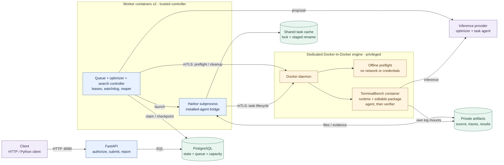
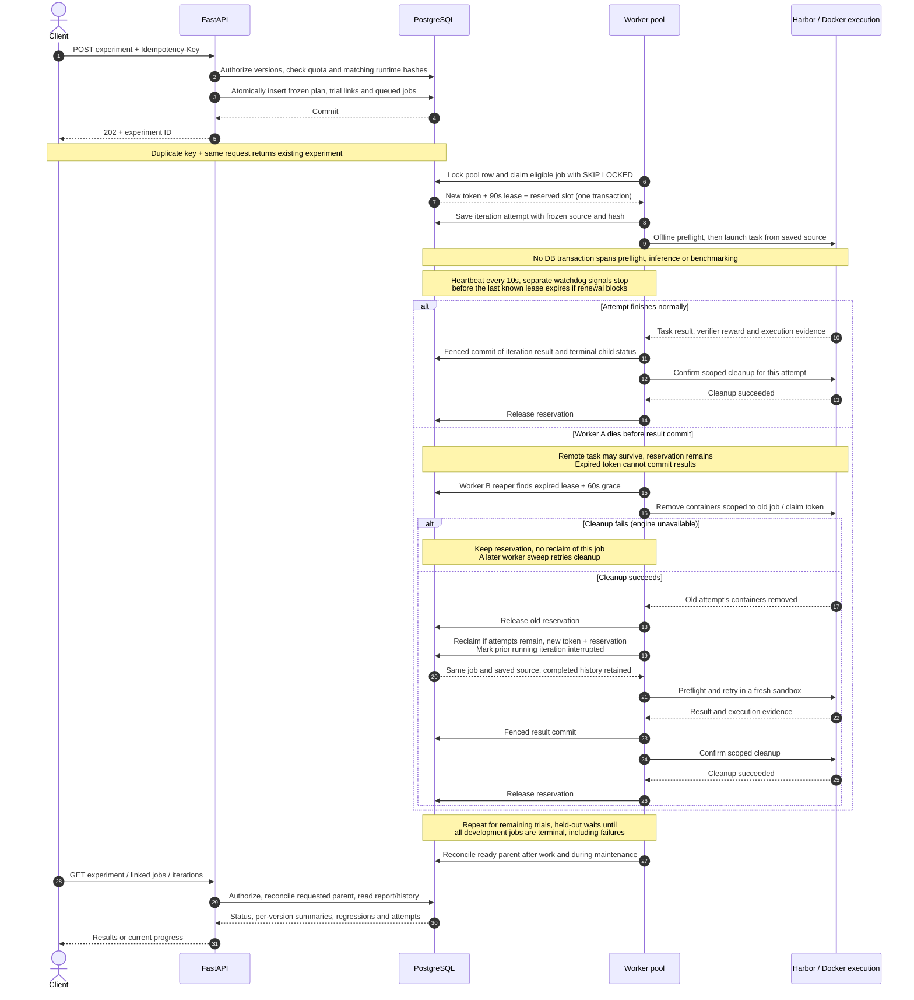
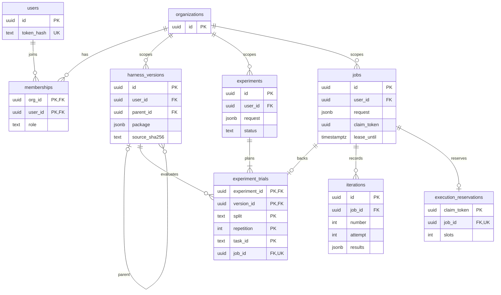
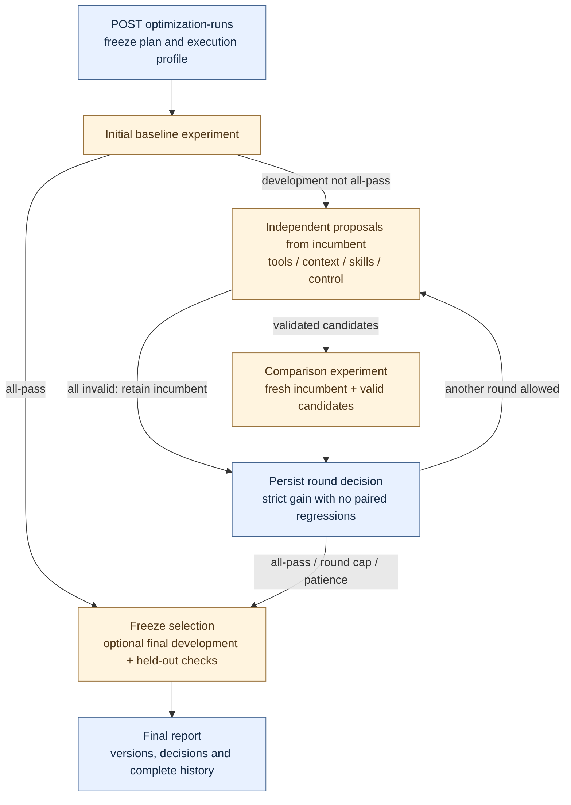

# Agent Optimization Service: architecture

This service turns an editable agent harness into a reproducible, asynchronous
experiment. A client submits work to FastAPI; PostgreSQL stores the plan and the
durable queue; workers validate and run frozen agent code in disposable Docker
task environments through Harbor. Results retain the source, proposal, validation,
task outcomes and attempt history needed to explain what happened.
Durable optimization runs coordinate repeated package proposals, comparisons and
selection without requiring a client process to stay alive.

The central separation is **the harness being changed versus the controller
measuring it**. Tools, context management, skills and agent control flow are
editable. Authentication, queue ownership, sandbox resources, benchmark verification
and the comparison's model profile belong to the controller.

This describes the implemented and deployed architecture at `46e7d4c`, reviewed
on 2026-09-08. The deployment uses one Docker engine, shared volumes, two workers
and two globally admitted task slots. [Automatic package search](#automatic-package-search)
builds on the same durable proposal and experiment primitives. Future scaling is
separated from implemented behavior; completed benchmark evidence is identified
separately from the automatic search whose live outcomes are still pending.

Jump to [deployment](#components-and-deployment), [workflows](#jobs-and-standalone-experiments),
[recovery](#submission-to-result-including-a-worker-crash),
[data ownership](#data-model-and-ownership), or [tradeoffs](#tradeoffs-and-future-scaling).
Standalone diagram sources and SVG exports are in [architecture/](architecture/).

## Components and deployment

This expands the [README architecture sketch](../README.md#design-decisions).
Arrows show control and data flow; the network and mount table below gives the
actual Compose wiring. Harbor is a worker subprocess, and the reaper is worker
maintenance code, not a separately deployed service.

<!-- diagram: deployment -->

| Component | Responsibility and access |
|---|---|
| API | Validates submissions, enforces tenant/owner access, returns `202` for queued work and serves history. Has database and bootstrap credentials; has no inference key, Docker client certificates or artifact mount. |
| PostgreSQL | Source of truth and durable queue. Also stores immutable packages, experiment plans, iteration evidence, leases and global capacity reservations. There is no Redis/Celery broker. |
| Workers | Advance search state, claim jobs, call the optimizer, checkpoint candidates, supervise execution, parse results and clean up attempts. Have database, inference and dedicated-engine credentials. Never import submitted agent code. |
| Harbor and bridge | Pinned Harbor environment in `/opt/harbor`; downloads tasks, creates task containers, installs the saved runtime, runs the agent and verifier, and collects artifacts. |
| Task runtime | Loads the package and executes `run_agent(api, instruction)` inside the task container. Model calls and bash execution occur here. Receives inference credentials and execution settings. |

Scored task containers receive one CPU and 2 GB RAM. The default agent profile
allows 300 seconds and 80 runtime model calls; a supervisor outside the editable
policy enforces the agent process deadline. These settings are held constant
across versions in a comparison. The separate 90-second renewable worker lease
controls ownership, not the task's execution budget.

The [Compose file](../compose.service.yaml) defines three networks: `backend`
(internal: API, database, migration process and workers), `execution` (workers and
the dedicated engine), and `frontend` (API). Only the API publishes a host port,
bound to loopback. Task containers are created **inside the dedicated engine**;
they are not Compose worker replicas. A one-shot migration process applies
versioned SQL before API/worker startup.

| Named volume | Mounted by | Purpose |
|---|---|---|
| `database` | PostgreSQL | Durable relational state |
| `artifacts` | Workers and dedicated engine, both at `/artifacts` | Run files available to the remote daemon for narrowly scoped task mounts |
| `benchmark-cache` | Workers | Shared Harbor task cache |
| `sandbox-images` | Dedicated engine | Nested Docker images and engine state |
| `sandbox-certificates` | Engine; read-only in workers | Mutual-TLS client credentials |

Task agents receive neither database/bootstrap credentials nor Docker sockets,
client certificates or the entire artifact volume. They can access their own
inference key. The dedicated engine is privileged infrastructure and Docker
shares a kernel; this deployment does not establish isolation for hostile public
multi-tenant execution. The runtime's accounting and agent-written traces are
also not a security boundary against malicious Python.

## Jobs and standalone experiments

All resource paths below are under `/organizations/{org}`.

| | Iterative optimization: `/jobs` | Package comparison: `/harness-versions`, `/experiments` |
|---|---|---|
| Unit being changed | One complete Python policy module: prompt, tools, context and control loop | Immutable package of modules, configuration, skills and resources |
| Proposal generation | Baseline evaluation, then a proposal from the current best source and development evidence | Separate queued proposal jobs for tools, context, skills or control flow; each can use an authorized parent, completed development evidence and review feedback |
| Scheduling unit | One job contains baseline and successive whole-subset evaluations | One job for each version, split, task and repetition |
| Frozen settings | Server execution settings captured at submission; worker rejects incompatible settings | One bounded model/profile snapshot copied to all trial jobs; comparison versions must share a runtime hash |
| Selection | Accept only a strictly higher mean reward with no previously passing task regressing | Report every frozen candidate independently; no automatic promotion |
| Stop conditions | Tie/regression, all tasks passed, iteration cap, invalid candidate or execution error | Finish when required trials terminate; a worse candidate does not stop the others |
| Recovery granularity | Retain completed iterations; rerun the interrupted iteration with its saved source | Retain completed task trials; retry only interrupted jobs |

In standalone experiments, package proposals are independent hypotheses. The
experiment endpoint does not perform multi-round search or promote its versions
into existing optimization jobs. A caller can submit a new comparison or a new
proposal from a saved parent explicitly. The resumable experiment client
orchestrates those API calls and saves IDs locally; its polling timeout does not
cancel server work. The search controller below automates orchestration
on top of these same proposal and experiment primitives.

### What a harness version freezes

A package contains `{entrypoint, files, skills}`: up to 32 UTF-8 files / 256,000
bytes, with Python modules, JSON configuration, Markdown procedures and supported
script/text resources. Skills declare a name, description, Markdown path and
resource paths. The sandbox API exposes `model`, `bash`, `tool_result`, `skills`,
`read_asset` and `asset_path`. This lets a version change tool schemas/dispatch,
context selection and compaction, skill loading, recovery and stopping behavior.

[Package snapshotting](../service/packages.py) records the canonical package
hash, individual file hashes, runtime hash, exact runnable-source hash, parent
version and file diffs. Runnable source embeds the package into the saved runtime;
retries use that saved source. Hashes identify the code under test; they do not
make a stochastic model response reproducible.

Validation has two stages. API/worker code treats the package as data: checks
paths, sizes, declared assets, Python/JSON syntax and entrypoint shape, and rejects
obvious benchmark identifiers and protected paths. A disposable offline container
then checks imports, a fixture model/tool interaction, message pairing and
termination. It has no network, credentials or task data, a read-only root
filesystem, 128 MB memory and a 15-second execution deadline. These are contract
checks, not exhaustive tool tests or proof of security or generalization.

A proposal's response is checkpointed before offline validation; once its version
is saved, recovery reuses it. Dynamically invalid versions remain inspectable.
Malformed package responses retain bounded, credential-redacted raw output and
provider completion/usage details when available. Direct version creation performs
static validation; scored trials also run the offline preflight.

## Submission to result, including a worker crash

This sequence follows an experiment using already frozen versions. The worker lane
represents the pool: worker B can recover work left by worker A. Execution details
are grouped into one lane; the component diagram shows the actual process boundary.

<!-- diagram: execution-recovery -->

Admission, implemented in [queue.py](../service/queue.py), locks the singleton
`execution_pool` row before checking reserved capacity and claiming a job with
`FOR UPDATE SKIP LOCKED`. Claim, lease and reservation commit together. Trials
and proposals reserve one slot; a legacy job reserves up to two, matching its
task concurrency. Proposal generation therefore shares the pool even while it
is waiting for inference. Admission prefers organizations with fewer reserved
slots, then older jobs; this is a simple fairness heuristic.

Every result/checkpoint write requires the job to be running, its claim token to
match, and its lease to remain unexpired. A reservation survives lease expiry;
only successful cleanup of that attempt returns its capacity. Cleanup matches
containers by their run mounts under `/artifacts/runs/{job_id}/{claim_token}/`.
Explicit container-not-found races are tolerated; engine/transport errors retain
the reservation. The worker reaper runs between jobs, so recovery latency includes
lease/grace expiry and a subsequent maintenance opportunity.

| Failure or interruption | Implemented behavior |
|---|---|
| Client loses the submission response | An idempotent retry returns the existing job/experiment; changed bodies with the same key return `409`. |
| Worker dies or cannot renew its lease | A separate monotonic watchdog signals execution to stop even if the heartbeat thread blocks. After lease expiry and cleanup grace, a surviving worker can clean and reclaim. |
| Old worker reports after cancellation/reclaim | Fenced writes fail. Up to three worker attempts are allowed; repeated lease loss then becomes an explicit failure. |
| Cancellation | API marks unfinished work cancelled and clears its lease, immediately fencing writes. Worker observes cancellation at heartbeat, stops execution and cleans up. Completed trials remain. |
| Crash after the last child commits | Parent status may temporarily lag; worker maintenance and the experiment detail read reconcile it from terminal children. |
| Shared cache writer dies mid-copy | Cross-process lock and staged rename prevent publication of a partial new task. A later copy removes abandoned staging; inference remains concurrent. |

Execution is **at least once**. Fenced commits protect database state, but a crash
before a checkpoint can repeat a model call or task execution and its cost.
Harbor automatic task retries are disabled; worker recovery is separate from a
scored rerun. Benchmark errors and failed verifications are retained rather than
silently retried to obtain a better score.

Development trials must all reach terminal status before held-out jobs become
eligible; they need not all pass. Proposal admission rejects held-out evidence
job IDs and freezes the authorized development evidence at submission. This
protects the service's evidence path; it cannot prevent a person from copying
results into feedback or establish that a model has never seen a benchmark task.

## Data model and ownership

The diagram shows the queue and experiment foreign-key relationships. Search-run
and round ownership are listed in the [search section](#automatic-package-search).
To keep the diagram compact,
`users -> resources` ownership edges are represented by the `user_id` fields.
An experiment has one or more trial links by application construction. Jobs for
proposals and legacy optimization have no `experiment_trials` row.

<!-- diagram: data-ownership -->

Versions, experiments, jobs and optimization runs each carry `org_id` and `user_id`. Authorization
is enforced in API queries, not PostgreSQL row-level security: an administrator
can see organization activity and manage memberships; a member can see only their
own resources. Parent versions, evidence jobs and iteration history use the same
visibility checks. Inaccessible resources return `404`. Users receive a random
256-bit bearer token once; only its SHA-256 hash is stored. Membership revocation
removes API access but does not itself cancel already queued work.

| Record | What is persisted |
|---|---|
| `harness_versions` | Immutable package and runnable source; all hashes, lineage, diffs and proposal. No version-update API is exposed. |
| `experiments` + `experiment_trials` | Frozen request/profile and selected versions; unique mapping of `(experiment, version, split, repetition, task)` to one durable job. |
| `jobs` | Owner, request/config snapshot, status, idempotency key, attempt count, claim/lease, best-iteration pointer, errors and proposal output/checkpoints. |
| `iterations` | Source, hash, validation, proposal, diff, bounded result/trace excerpts and acceptance, keyed uniquely by `(job, number, attempt)`. Interrupted/rejected history remains visible. |
| `execution_pool` + `execution_reservations` | One configured capacity row and at most one reservation per job. Reservation token identifies the attempt; it is not a foreign key to the mutable `jobs.claim_token`. |

`jobs.request` also contains proposal/trial version references as JSON; those are
not additional SQL foreign keys. Trial-to-version relations are enforced by
`experiment_trials`. There is no separate skills table: declarations and assets
live in the version's package. Model/profile snapshots are JSON in experiment/job
requests, not a separate model registry.

PostgreSQL holds bounded, authorized evidence. The private artifact volume holds
raw Harbor files, model requests, independent tool-event traces and supervisor
exit/timeout metadata. Context compaction changes the model's working history
without discarding the separately recorded events. Known service key values are
redacted from persisted excerpts and truncation is marked. Raw artifacts have no
public HTTP route and currently need operator retention management.

Job status and benchmark success mean different things: a valid zero reward is a
completed trial. Recognized Harbor agent timeouts can be scored as zero; other
missing/invalid rewards produce an error. A version/split summary has a final
score only when all its required jobs succeed; missing results remain represented
and leave that summary's score null. Parent `succeeded` means the experiment
completed without failed/cancelled children, not that every task passed.

## Automatic package search

Automatic package search is implemented and deployed at `46e7d4c`. The recorded
66-test PostgreSQL suite covers multi-round selection, regression rejection,
controller recovery and client resume. Its live model evaluation is still in
progress; the completed operational drill and 36-trial comparison below predate
this orchestration layer and do not establish its live search outcomes.

[`searches.py`](../service/searches.py) adds `/optimization-runs` as a server-driven
state machine over existing proposal jobs and experiments. It selects the parent
for the next round and the run's final version; it does not change deployment
defaults, historical best pointers or other experiments. It runs on the same API,
PostgreSQL, workers and execution engine.

<!-- diagram: package-search -->

The controller advances a ready run between worker jobs. It locks that run with
`FOR UPDATE SKIP LOCKED`; child creation and the next phase commit together. A
crash before commit rolls both back; after commit, another worker sees the saved
child IDs. This transition performs no inference and reserves no task slot. Its
proposal/trial children all pass through the existing pool and lease protocol.
It may wait for a busy worker or organization quota; there is no separate
always-running scheduler or wall-clock search deadline.

| Added record | Relationship and purpose |
|---|---|
| `optimization_runs` | Owned by `org_id` / `user_id`; stores the plan, frozen execution profile, phase, initial/current version, baseline/evidence/final experiment references and stopping counters. One active run per organization is admitted. |
| `optimization_rounds` | Keyed by `(run_id, number)`; references the parent version and comparison experiment, with proposal job IDs in JSON and the persisted selection decision. |

Each round uses the incumbent's development evidence and prior decisions, never
held-out outcomes. Candidates must beat a fresh incumbent measurement without a
paired passing task/repetition regressing. The highest eligible score wins;
ties keep the first eligible candidate in persisted plan order. Invalid proposals
and failed candidate evaluations remain recorded; no valid candidates counts
toward patience. A missing reference score fails the run explicitly. New proposals
require the incumbent's runtime hash to match the deployed runtime.

Search stops on all-pass development, the round limit or consecutive rounds
without improvement. Optional final checks compare the original baseline and
selected version through an experiment with fresh development confirmation
before its held-out split. Neither final split changes selection or starts more
proposals. This remains a conservative selection heuristic, not a statistical
significance test. See [AUTOMATIC_OPTIMIZATION.md](AUTOMATIC_OPTIMIZATION.md),
[search_api.py](../service/search_api.py) and
[migration 005](../service/migrations/005_optimization_runs.sql) for the extension's
contract.

## Tradeoffs and future scaling

| Current design choice | Benefit | Cost or next step |
|---|---|---|
| PostgreSQL queue and state in one transaction | No database/broker dual-write gap; claims, ownership and admission are inspectable together | Polling, database connections and the serialized pool row limit scale. Add connection pooling and measure contention before splitting queue infrastructure. |
| Independent immutable candidates and task jobs | Exact source attribution; completed trials survive recovery; one poor candidate does not erase others | More records and per-trial setup/preflight. Larger repeated evaluations and statistical selection are still needed. |
| Reservation retained until cleanup | Expired workers cannot free capacity while their remote containers still run | An unavailable engine can leave capacity blocked. Liveness depends on engine recovery and worker maintenance. |
| One shared pool for proposals and trials | Simple global bound across all managed worker processes | No separate inference quotas, weighted tenant fairness or spend admission; slow proposals can occupy trial capacity. |
| Dedicated Docker engine and private volumes | Practical local integration, scoped cleanup and separation of API from execution credentials | Shared kernel, privileged engine and one storage/engine failure domain. Stronger deployments need VM/microVM isolation, sandbox placement and egress/disk controls. |
| Raw files outside PostgreSQL; bounded excerpts inside | Rich inspection without putting every artifact into API responses or database rows | No atomic DB/filesystem commit or automatic retention. Multi-host execution needs durable object storage and artifact lifecycle management. |

Adding worker replicas today increases available consumers but **does not raise
the global task-slot limit**. Replicas still depend on this installation's
PostgreSQL, artifact volume and engine. Multi-host or highly available operation
would require a different sandbox/storage placement design plus database
availability and backup arrangements; it is not established by the current
four-process failure drill.

Other future work includes a scoped inference proxy/short-lived credentials,
provider-rate and spend controls, token expiry/rotation, audit events and an
explicit statistical promotion policy. E2B is not an implemented provider. The
older operator `service.experiments` CLI bypasses managed admission; the guarantees
above describe work submitted through the durable API.

## Evidence and source map

The [operational report](OPERATIONS.md) records a real four-worker/two-slot drill:
worker death with a surviving remote container, stale-write rejection, retained
completed history, cancellation, sandbox interruption and eventual cleanup. Peak
observed containers/reservations were two and no leftovers remained. Its 30.95-second
duration used synthetic four-second tasks and shortened leases, so it is evidence
of recovery correctness, not LLM throughput. The earlier `ce5bd08` checkpoint had
58 passing PostgreSQL tests and passing CI. The implementation handoff records
66 passing tests at `46e7d4c`, including the automatic-search integration tests;
this documentation pass does not rerun the live services or benchmark work.

The [recorded package comparison](PACKAGE_EXPERIMENT.md) completed 36 trials in
30m11s with zero runner errors or worker retries. Traces demonstrate structured
tool results, context compaction and skill loading. No candidate improved pass
rate and none was promoted. The designated held-out split had appeared in an
earlier experiment; it is not newly unseen data.

| Design claim | Primary implementation |
|---|---|
| Deployment and dependency separation | [Compose](../compose.service.yaml), [Dockerfile](../service/Dockerfile) |
| Authentication, ownership, idempotency and submissions | [api.py](../service/api.py), [campaign_api.py](../service/campaign_api.py) |
| Frozen versions, plans and summaries | [packages.py](../service/packages.py), [campaigns.py](../service/campaigns.py), [config.py](../service/config.py) |
| Atomic admission, fenced writes and recovery | [queue.py](../service/queue.py), [worker.py](../service/worker.py), [pool.py](../service/pool.py) |
| Sandboxes, cleanup, cache and evidence | [runner.py](../service/runner.py), [harbor_agent.py](../service/harbor_agent.py), [harbor_cli.py](../service/harbor_cli.py), [runtime.py](../service/runtime.py) |
| Proposal generation | [package_optimizer.py](../service/package_optimizer.py), [optimizer.py](../service/optimizer.py), [evidence.py](../service/evidence.py) |
| Automatic search, selection and recovery | [searches.py](../service/searches.py), [search_api.py](../service/search_api.py), [005 optimization runs](../service/migrations/005_optimization_runs.sql), [test_searches.py](../tests/test_searches.py) |
| Relational constraints | [001 initial](../service/migrations/001_initial.sql), [002 agent code](../service/migrations/002_agent_code.sql), [003 experiment platform](../service/migrations/003_experiment_platform.sql), [004 queue indexes](../service/migrations/004_experiment_queue_indexes.sql) |
| Recovery assertions | [test_campaigns.py](../tests/test_campaigns.py), [test_service.py](../tests/test_service.py), [operational_proof.py](../tests/operational_proof.py) |

For request schemas and client examples, see [EXPERIMENT_PLATFORM.md](EXPERIMENT_PLATFORM.md).

## Message to the interviewer (draft)

> I've documented the implemented architecture, including the deployment, the
> submission and crash-recovery sequence, and data ownership. The main separation
> is between the editable harness (tools, context, skills and control flow) and the
> fixed evaluation controller. FastAPI and PostgreSQL manage durable work, while
> workers run frozen versions in Docker sandboxes and retain every trial attempt.
> A durable search controller coordinates successive package proposals and
> comparisons, selecting improvements from development evidence.
> The write-up also covers the tradeoffs and what would change for multi-host
> deployment. The design is in `docs/ARCHITECTURE.md` on the PR branch.
