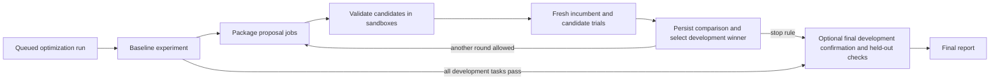

# Automatic optimization of full harness packages

`POST /organizations/{org}/optimization-runs` creates a durable search. The
service evaluates a baseline, generates independent package proposals, compares
them against a fresh evaluation of the incumbent, selects an eligible improvement,
and repeats. No client process needs to stay alive to advance the search.

```sh
python test_client.py --optimize --state workspace/search-state.json --output workspace/search-results.json --max-rounds 2 --patience 2
```

Default development set: the documented ten tasks; one repetition; three proposal
dimensions (tools, context, skills). Agent and optimizer settings come from `.env`
and are frozen at submission. A run can optionally start from a visible existing
`--baseline-version-id`. Reuse `--state` to resume monitoring; its stored plan and
run ID override new command-line choices. The output includes all rounds,
decisions, proposal failures, exact versions and complete task iteration history.
Client timeout leaves the server running and saves a partial report.

For a bounded diagnostic run using control flow as a search dimension:

```sh
python test_client.py --optimize --state workspace/diagnostic-search-state.json --output workspace/diagnostic-search-results.json --task-ids configure-git-webserver extract-elf --dimensions context skills control --max-rounds 2 --patience 2 --heldout-task-ids large-scale-text-editing
```

This is a selected diagnostic subset, not a full benchmark score. With one
repetition, at most six proposals and 24 scored task executions occur: two initial
baseline tasks, up to eight comparisons per round, and at most six final checks.
Invalid proposals reduce the evaluated candidate count. A perfect development
score, the round cap or consecutive rounds without an eligible gain stops search.

## State and recovery



`optimization_runs` records the input plan, execution profile, current phase,
initial/incumbent versions, score, round number, plateau count and stopping reason.
`optimization_rounds` records each parent, proposal job IDs, comparison experiment
and selection decision. Existing experiments/jobs/iterations store actual work.

Each worker advances one ready search between ordinary job executions. The
controller takes a run row lock with `SKIP LOCKED`; creating child jobs and
recording the next state commit together. If the process dies before commit,
both roll back. After commit, another controller sees the same child IDs. The
controller never waits for a model and never reserves a sandbox slot. Advancement
may wait until a busy worker finishes its current task; this implementation has
no separate always-running scheduler or wall-clock search deadline.

Task/proposal execution retains the existing leases, heartbeat watchdog,
checkpoint reuse, retry fencing and cleanup-before-capacity-release rules. A
controller retry does not re-create completed trials. Interrupted inference can
still repeat before a proposal checkpoint; this is at-least-once external work.

One active search is allowed per organization, along with existing shared job
and experiment quotas. The controller waits if an organization has no admission
quota; it does not partially submit a round. Every costly child uses the same
global task-slot pool as manual jobs and experiments. New proposals require the
incumbent's runtime hash to match the deployed runtime; a changed runtime stops
search explicitly while preserving saved versions and results.

## Search and selection

Choose up to three dimensions from `tools`, `context`, `skills`, and `control`.
The control operator can change planning, recovery, verification and termination
logic. Each proposal starts from the current incumbent's complete package; it
receives that version's latest development traces and prior round decisions,
including rejected diagnoses and regressions. Held-out results are excluded.

Every comparison re-evaluates the incumbent under the same profile and tasks as
its candidates. A candidate is eligible only if its mean reward is strictly
higher than the incumbent in this comparison and no paired previously passing
task/repetition fails. The highest eligible score wins; a tie keeps the first
candidate in the persisted plan order. This is a conservative heuristic, not a
statistical significance test. The score shown for the incumbent is its latest
measurement, not the maximum favorable score seen in previous runs.

Rejected and invalid proposals stay in history. A failed candidate evaluation is
ineligible; other candidates can still be compared. If the reference evaluation
has missing results, the run fails rather than inventing a learning signal. If
all proposals are invalid, the round counts toward patience and the incumbent
is retained. A `succeeded` run means the search reached a stopping rule; inspect
its round outcomes for proposal failures and task failures.

After selection stops, optional final checks compare the original baseline and
selected package (one version if unchanged). The existing experiment contract
runs a fresh development confirmation before its held-out split. Neither final
split changes selection, and no more proposals follow. This extra confirmation
is explicitly included in the run budget above. Selection is internal to this
search: it chooses the next parent and final version, without changing deployment
defaults, prior job best pointers or other experiments.

## API and limits

All routes require organization membership and normal owner/admin visibility.

| Route under `/organizations/{org}` | Behavior |
|---|---|
| `POST /optimization-runs` | 202; durable plan; optional `Idempotency-Key` |
| `GET /optimization-runs` | Bounded list visible to this caller |
| `GET /optimization-runs/{id}` | Status, rounds, proposals, decisions and linked trial experiments |
| `POST /optimization-runs/{id}/cancel` | Fence unfinished children; preserve completed results |

Inputs: `name`, optional `baseline_version_id`, `development_task_ids`, optional
`heldout_task_ids`, `dimensions`, `repetitions` (1–2), `max_rounds` (1–3), `patience`
(1–3), and the normal agent `profile`. Limits and duplicates are validated before
admission. Changed plans under the same idempotency key return 409.

Cancellation locks the run before children, preventing a concurrent controller
from scheduling another round. It immediately fences pending/running jobs; their
workers perform scoped cleanup before releasing reservations. Finished rounds,
versions and trials remain accessible through their existing APIs.

PostgreSQL tests exercise two-round selection, regression rejection, failed
proposals, frozen settings, controller rollback/concurrency, cancellation and
held-out exclusion. The client test uses real HTTP and retrieves/resumes the full
multi-round history with fixture inference. These establish service behavior;
live model outcomes are reported separately.
